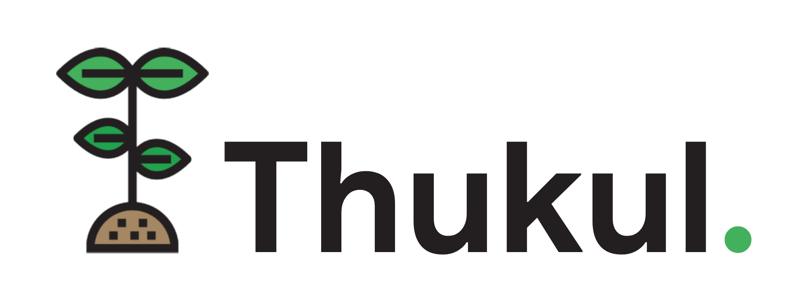

 

  
  
  <h3 align="center">Thukul Service</h3>

  

    This project is the result of my work in the Full Stack Engineering class by Alterra Academy, this project focuses on making REST APIs using the Golang language with Clean Architecture. This project is a financial management project for expenses and income for each user and there are also investment assets in the form of cryptocurrencies to increase our assets in digital finance in particular, with a secure transaction system and equipped with 2-step verification.
     
    <a href="https://github.com/aprian1337/thukul-service"><strong>Explore the docs »</strong></a>
     
     
    <a href="#!">View Demo</a>
    ·
    <a href="https://github.com/aprian1337/thukul-service/issues">Report Bug</a>
    ·
    <a href="https://github.com/aprian1337/thukul-service/issues">Request Feature</a>
  

# Contents :
- [Entity Relationship Diagram ERD](#entity-relationship-diagram-erd)
- [System Environment](#system-environment)
- [Technologies What I Used](#technologies-what-i-used)
- [Deployment](#deployment)
- [How to Run?](#how-to-run)
- [Wanna Try?](#wanna-try)

# Entity Relationship Diagram (ERD)
---

# System Environment

1. [Go v1.17.2](https://golang.org/)
2. [PostgreSQL v12.8](https://www.postgresql.org/)
3. [Docker v20.10.8](https://www.docker.com/)
4. [MongoDB v3.6.8](https://www.mongodb.com/)

# Technologies What I Used
1. [JSON Web Token - JWT v3.3.2](https://github.com/golang-jwt/jwt)
2. [GORM v1.21.15](https://gorm.io/)
3. [Echo v4.5.0](https://echo.labstack.com/)
4. [UUID v1.3.0](https://github.com/google/uuid)
5. [Viper v1.9.0](https://github.com/spf13/viper)
6. [Testify v1.7.0](https://github.com/stretchr/testify)
7. [Mockery v2](https://github.com/vektra/mockery)
8. [SMTP](https://pkg.go.dev/net/smtp)

# Deployment
1. Amazon Elastic Compute Cloud (Amazon EC2) - For Main Server
2. Amazon Relational Database Service (Amazon RDS) - For PostgreSQL Server
3. MongoDB Atlas - For MongoDB Server
4. Docker - For Containerization
5. Github Action - For Continous Integration/Continous Deployment

# How to Run Locally?
1. Clone this repository first
2. Rename config.json.example to config.json on root folder
3. Set up with your environment on config.json
4. Run `go run main.go` or `go run app/main.go`

# Wanna Try?
Live Server On : [http://ec2-3-16-108-99.us-east-2.compute.amazonaws.com](http://ec2-3-16-108-99.us-east-2.compute.amazonaws.com)
